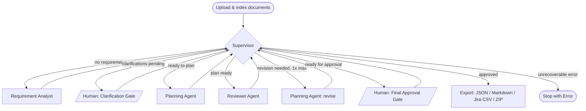

# Agentic Project Planning Copilot

> Turn raw requirement documents into a reviewable, exportable Agile project plan — epics,
> user stories, acceptance criteria, technical tasks, dependencies, a RAID log, and a sprint
> plan — using four coordinated local AI agents. No cloud LLM, no API key, runs entirely on
> your own machine.

Project requirements usually arrive as messy business documents, meeting notes, and emails. A
project manager or business analyst then has to manually turn that into scope, epics, stories,
acceptance criteria, tasks, dependencies, risks, and a sprint plan — slow, repetitive, and easy
to get inconsistent. This tool automates a first, reviewable draft of that work using
specialised AI agents, while keeping a human in control of every approval.

Built against a detailed internal specification (kept private — not part of this public
repository) covering agent responsibilities, tool contracts, Pydantic schemas, guardrails, and
a day-by-day execution plan; this README and the linked guides summarize everything relevant
to using or extending the project.

## Table of Contents

- [Features](#features)
- [Architecture](#architecture)
- [Quick start](#quick-start)
- [Usage walkthrough](#usage-walkthrough)
- [Evaluation results](#evaluation-results)
- [Project structure](#project-structure)
- [Documentation](#documentation)
- [Tech stack](#tech-stack)
- [Testing](#testing)
- [Known limitations](#known-limitations)
- [Future improvements](#future-improvements)
- [License](#license)

## Features

- **Four specialist agents** coordinated by a LangGraph state graph, each reachable only
  through registered tools — no shell access, no arbitrary code execution.
- **Multi-format document ingestion** — PDF, DOCX, TXT, Markdown — with heading-aware
  chunking and hybrid retrieval (dense + BM25, fused with Reciprocal Rank Fusion).
- **Strict, deterministic grounding** — every important item is classified SOURCE_BACKED /
  CLARIFICATION_BACKED / ASSUMPTION / AI_RECOMMENDATION, and every SOURCE_BACKED claim carries
  a citation that's verified against real chunk metadata, not just trusted from the model.
- **Independent review + one bounded revision cycle** — the Planning Agent never grades
  its own output; the Reviewer can send it back for exactly one revision, never more.
- **Two mandatory human approval gates** — clarification review and final plan approval.
  Agents can never self-approve or export an unapproved plan as approved.
- **Full artifact set** — epics, user stories with Given/When/Then acceptance criteria,
  technical tasks, dependencies, a RAID log, and an Agile sprint plan, all traceable back to
  their source requirement.
- **Plan version history** — every regeneration is preserved; compare generation
  timestamp, model, prompt version, and content across versions.
- **Jira-ready export** — JSON, Markdown, a Jira-compatible CSV, and a bundled ZIP.
- **Evaluated, not just built** — 372 automated tests plus a dedicated evaluation suite
  measuring extraction accuracy, routing correctness, retrieval quality, and reviewer
  effectiveness against three synthetic project scenarios — see
  [Evaluation results](#evaluation-results) below.

## Architecture



Four specialist agents, each with one clear responsibility:

- **Supervisor** — decides which agent runs next; never generates artifacts, never self-approves.
- **Requirement Analyst** — extracts requirements, flags contradictions and ambiguities, asks
  clarifying questions instead of guessing.
- **Planning Agent** — synthesizes the actual plan from approved requirements.
- **Reviewer Agent** — independently QAs the plan against the source documents and mandatory
  schemas. It's a *separate* agent by design, so the planner never grades its own homework.

The Supervisor is a hub, not a pipeline stage — every agent routes back through it, and a
**deterministic router** (not the Supervisor's own judgment) enforces loop limits and gate
rules, so a misbehaving LLM call can never cause an infinite loop or skip a human approval.
Shared workflow state holds only IDs, flags, and counters — never document or artifact content,
which lives in SQLite/Qdrant instead (§19's own design constraint: keep the graph state small
and reference-only).

Everything mechanical — document parsing, chunking, embedding, schema validation, duplicate
detection, traceability checks, CSV generation — is deterministic Python, not agent reasoning;
only judgment calls go through an LLM. This split is a hard rule the codebase enforces
throughout: deterministic work never moves into a prompt, and agent judgment never substitutes
for a mechanical check (a Pydantic validator, not the Reviewer's own opinion, is what
ultimately blocks a plan with a duplicate ID or a dangling citation from being accepted).

**Retrieval (RAG) pipeline**: uploaded documents are parsed (PyMuPDF/python-docx/plain text),
split with heading-aware chunking, embedded locally (`bge-small-en-v1.5`), and stored in two
isolated Qdrant collections — `project_knowledge` (strictly filtered by `project_id`, never
crosses between projects) and `organizational_knowledge` (shared company standards). Every
query runs dense search and BM25 over the same candidate set, fused with Reciprocal Rank
Fusion, and every result carries full provenance (document, page, section, chunk ID) so a
citation can always be traced back to real source text.

**Guardrails that hold regardless of what the model does**: agents reach the system only
through registered tools — there's no shell tool, no arbitrary-code tool, and no path for a
prompt-injected instruction in an uploaded document to reach privileged state (`final_approved`
and `clarification_approved` are only ever set by the two human-approval API endpoints,
confirmed by a source-scan test, not just documented). Loop limits (one requirement-analysis
retry, one schema-validation retry, one planning revision, one reviewer rerun) are plain Python
counters checked by the router, never left to an agent's own judgment about when to stop.

## Quick start

Prerequisites: Python 3.12+, [Ollama](https://ollama.com) running `qwen3:4b-instruct`, Node 18+
(for the frontend). No Qdrant install or Docker required for local dev — the backend defaults
to an embedded, file-backed Qdrant store.

```bash
cp .env.example .env
pip install -e ".[dev]"
uvicorn app.main:app --reload      # backend → http://localhost:8000/health

cd frontend && npm install && npm run dev   # frontend → http://localhost:5173
```

Or run the full stack in Docker:

```bash
docker compose up --build
```

## Usage walkthrough

1. **Create a project** — name, description, methodology (Agile/Scrum), team, constraints.
2. **Document Workspace** — upload requirement documents (PDF/DOCX/TXT/Markdown), then index
   them (embeds and stores chunks in the local vector store — a required, separate step).
3. **Start the workflow** — the Supervisor takes over; watch progress on the **Agent
   Execution** screen (safe summaries only — hidden model reasoning is never shown).
4. **Clarification Workspace** — answer, defer, or mark clarification questions not
   applicable, then approve to unblock planning (the human gate — planning never starts on
   its own).
5. **Planning Workspace** — review the generated summary, scope, epics, stories, tasks,
   dependencies, RAID log, sprint plan, and traceability matrix, each tagged with its
   grounding classification.
6. **Reviewer Screen** — see the Reviewer's findings and decision; approve the final plan (the
   second human gate — the agent can never approve its own output).
7. **Export Screen** — download JSON, Markdown, Jira CSV, or a bundled ZIP.

Full detail on every screen: [USER_GUIDE.md](USER_GUIDE.md).

## Evaluation results

| Area | Result | Report |
|---|---|---|
| Requirement extraction | 97.9% of gold-standard requirements found, 0 invented | [Day 19](evaluation/reports/day19_evaluation_report.md) |
| Clarification quality | 100% of generated questions judged useful | [Day 19](evaluation/reports/day19_evaluation_report.md) |
| Retrieval | 100% correct-source across 32 queries, ~20ms mean latency | [Day 21](evaluation/reports/day21_evaluation_report.md) |
| Requirement → plan coverage | 100% (0 gaps), up from a 71% baseline | [Day 22](evaluation/reports/day22_evaluation_report.md) · [Day 23](evaluation/reports/day23_evaluation_report.md) |
| Citation accuracy | 100% across every live-verified run | [Day 22](evaluation/reports/day22_evaluation_report.md) · [Day 23](evaluation/reports/day23_evaluation_report.md) |
| Final plan structural validity | Confirmed valid after a full revision cycle | [Day 23](evaluation/reports/day23_evaluation_report.md) |

Every number above comes from a live run against `qwen3:4b-instruct` (not a mocked model) —
full methodology, raw data, and honestly-reported findings are in each linked report.

## Project structure

```
app/          FastAPI backend: agents, workflow, tools, api, database, models, schemas, services, prompts
frontend/     React UI
tests/        unit + integration tests
evaluation/   synthetic scenarios, expected results, scripts, reports (spec §23, §24)
sample_documents/  synthetic requirement + company-standard documents
docs/         local working notes (architecture rationale, day-by-day build log) — not
              tracked in this repository; see User Guide / Developer Guide / this README
              for the tracked, canonical documentation
```

## Documentation

Everything below is tracked in this repository — nothing needed to understand or run this
project lives only in a local, untracked file:

- [User Guide](USER_GUIDE.md) — how to use the app, screen by screen.
- [Developer Guide](DEVELOPER_GUIDE.md) — architecture internals, extension patterns, the
  Jira CSV field mapping, running the evaluation suite.
- [Known limitations](#known-limitations) and [Future improvements](#future-improvements) —
  sections of this README, not separate files, so they're never one click away from missing.
- [Evaluation reports](evaluation/reports/) — every claim in this README's
  [Evaluation results](#evaluation-results) table traces to a real report in this directory.

## Tech stack

| Layer | Choice |
|---|---|
| Language | Python 3.12+ |
| Agent orchestration | LangGraph |
| Local LLM runtime | Ollama, `qwen3:4b-instruct` |
| Embeddings | Sentence-Transformers, `BAAI/bge-small-en-v1.5` |
| Vector store | Qdrant (embedded, file-backed by default — no server required) |
| Backend | FastAPI, Pydantic, SQLAlchemy, SQLite |
| Frontend | React, TypeScript, Vite |
| Document parsing | PyMuPDF (PDF), python-docx (DOCX) |
| Testing | Pytest, FastAPI TestClient, Vitest |
| Packaging | Docker, Docker Compose |

No paid API is required anywhere in the stack.

## Testing

```bash
pytest                    # fast suite (372 tests, ~5-10 min)
pytest -m slow            # live-model integration tests (hours — real Ollama calls)
ruff check app tests
cd frontend && npm run lint && npm run test
```

## Known limitations

This project runs entirely on local, CPU-only inference by default (Ollama serving
`qwen3:4b-instruct` — no GPU, no cloud API), which is the real practical constraint on how
this system performs:

- A single Requirement Analyst call takes roughly 10-15 minutes.
- A full Planning Agent sequence (summary/scope/epics -> stories -> tasks/RAID -> sprint plan)
  takes 30-60+ minutes.
- A Reviewer call takes 3-15 minutes.
- A full pipeline run with one revision cycle has taken 1-2.5 hours across this project's live
  evaluation runs.

This is a direct, structural cost of local-only inference on ordinary CPU hardware, not a
defect — see [Future improvements](#future-improvements) for what would change it (GPU
inference, a smaller/faster model, or restructuring long agent calls as async background jobs
instead of synchronous requests).

## Future improvements

### Stretch goals attempted or still open

| Idea | Status |
|---|---|
| Hybrid keyword + vector search | Done — shipped as part of the core retrieval pipeline, not a stretch add-on |
| Plan version comparison | Partial — every version is fully queryable via the API; a UI diff view isn't built yet |
| Local reranking model | Deliberately dropped — the pipeline's generation latency (not retrieval) was already the bottleneck, so adding another local-model inference pass wasn't worth it |
| Direct Jira issue creation, visual dependency graph, DOCX export, requirement-change impact analysis, user-selectable models, selective artifact regeneration, agent execution replay, project-plan chat interface | Not attempted — each is a genuinely separate feature, not a small extension of what exists |

### What this build's own experience surfaced

- **A real database migration tool.** Schema changes to an already-created local database
  currently require a manual `ALTER TABLE` or a fresh database — this has already caused one
  real (if minor) issue. A migration tool would remove this class of problem entirely.
- **Extend the "schema over prompt" technique further.** The story-points and dependency-
  description fixes established a real, generalizable pattern: a required, narrowly-typed
  schema field reliably beats a prose instruction for getting a small local model to produce
  something consistently. Worth auditing every remaining model-facing schema for the same
  opportunity.
- **Extend the deterministic-backfill pattern beyond epic coverage.** The coverage-backfill
  mechanism (check for a gap after generation, pay for one more narrow LLM call only if a gap
  is actually found) is a working template that could plausibly help with other
  prompt-alone-isn't-reliable-enough gaps, like missing acceptance criteria.
- **GPU inference, or a smaller/faster model, as a path to production viability.** The single
  biggest practical limitation of this build is CPU-only latency. Before any production use,
  this needs either GPU-accelerated inference, a faster model traded against quality, or
  restructuring long agent calls as async background jobs instead of synchronous requests.
## License

MIT — see [LICENSE](LICENSE).
