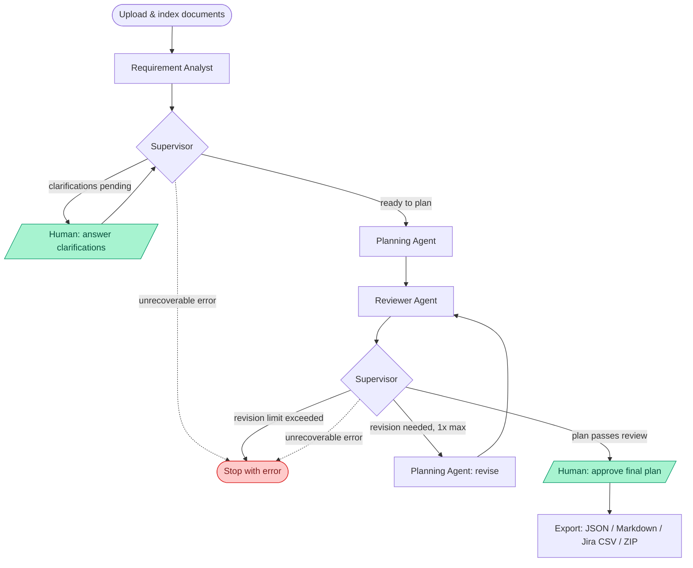

# Agentic Project Planning Copilot

> Turn raw requirement documents into a reviewable, exportable Agile project plan — epics,
> user stories, acceptance criteria, technical tasks, dependencies, a RAID log, and a sprint
> plan — using four coordinated local AI agents. No cloud LLM, no API key, runs entirely on
> your own machine.

Project requirements usually arrive as messy business documents, meeting notes, and emails. A
project manager or business analyst then has to manually turn that into scope, epics, stories,
acceptance criteria, tasks, dependencies, risks, and a sprint plan — slow, repetitive, and easy
to get inconsistent. This tool automates a first, reviewable draft of that work using
specialised AI agents, while keeping a human in control of every approval.

Built against a detailed internal specification (kept private — not part of this public
repository) covering agent responsibilities, tool contracts, Pydantic schemas, guardrails, and
a day-by-day execution plan; this README and the linked guides summarize everything relevant
to using or extending the project.

## Table of Contents

- [Features](#features)
- [Architecture](#architecture)
- [Quick start](#quick-start)
- [Usage walkthrough](#usage-walkthrough)
- [Evaluation results](#evaluation-results)
- [Project structure](#project-structure)
- [Documentation](#documentation)
- [Tech stack](#tech-stack)
- [Testing](#testing)
- [Known limitations](#known-limitations)
- [Future improvements](#future-improvements)
- [License](#license)

## Features

### Planning pipeline

- **Multi-format ingestion.** PDF, DOCX, TXT, and Markdown, with heading-aware chunking and
  hybrid retrieval (dense embeddings plus BM25, fused with Reciprocal Rank Fusion).
- **Complete artifact set.** Epics, user stories with Given/When/Then acceptance criteria,
  technical tasks, dependencies, a RAID log, and an Agile sprint plan, each traceable to its
  source requirement.
- **Jira-ready export.** JSON, Markdown, DOCX, a Jira-compatible CSV, and a bundled ZIP.

### Agents and safeguards

- **Four specialist agents.** Coordinated by a LangGraph state graph and reachable only
  through registered tools — no shell access, no arbitrary code execution.
- **Independent review.** The Planning Agent never grades its own output; a separate Reviewer
  can send the plan back for exactly one revision cycle, never more.
- **Two mandatory approval gates.** Clarification review and final plan approval are
  human-only. Agents cannot self-approve or export an unapproved plan as approved.
- **Deterministic grounding.** Every important item is classified SOURCE_BACKED /
  CLARIFICATION_BACKED / ASSUMPTION / AI_RECOMMENDATION, and every SOURCE_BACKED claim carries
  a citation verified against real chunk metadata rather than trusted from the model.

### Working with plans

- **Version history and diffing.** Every regeneration is preserved, and a comparison view
  diffs any two versions across epics, stories, tasks, and dependencies.
- **Selective regeneration.** Rebuild just the sprint plan, or just tasks, dependencies, and
  RAID, without regenerating epics and stories. Plan approval resets automatically, so a
  regenerated plan can never export as approved without re-review.
- **Requirement-change impact analysis.** Trace every epic, story, task, and dependency back
  to a given requirement, reusing the existing traceability matrix.
- **Visual dependency graph.** A layered dependency-DAG view alongside the list, with cycle
  detection.
- **Execution replay.** Step, scrub, and replay a run's execution log after the fact, not
  only while it runs.

### Evaluation

- **Measured, not just built.** 394 automated tests plus a dedicated evaluation suite covering
  extraction accuracy, routing correctness, retrieval quality, and reviewer effectiveness
  across three synthetic project scenarios — see [Evaluation results](#evaluation-results).

## Architecture



> The two "Supervisor" nodes are the same agent re-evaluating state after each step. The
> diagram simplifies this to two checkpoints for readability; the real workflow re-evaluates
> after every node, including after a revision.

### Agents

- **Supervisor** — decides which agent runs next. Never generates artifacts, never self-approves.
- **Requirement Analyst** — extracts requirements, flags contradictions and ambiguities, and
  asks clarifying questions instead of guessing.
- **Planning Agent** — synthesizes the plan from approved requirements.
- **Reviewer Agent** — independently QAs the plan against the source documents and required
  schemas. It is a separate agent by design, so the planner never grades its own work.

### Control flow

The Supervisor is a hub rather than a pipeline stage: every agent routes back through it. A
deterministic router, not the Supervisor's judgment, enforces loop limits and gate rules, so a
misbehaving LLM call cannot cause an infinite loop or skip a human approval. Shared workflow
state holds only IDs, flags, and counters; document and artifact content lives in SQLite and
Qdrant.

### Deterministic core

Everything mechanical — document parsing, chunking, embedding, schema validation, duplicate
detection, traceability checks, CSV generation — is deterministic Python. Only judgment calls
go through an LLM, and the split is enforced throughout: a Pydantic validator, not the
Reviewer's opinion, is what blocks a plan with a duplicate ID or a dangling citation.

### Retrieval (RAG)

Uploaded documents are parsed (PyMuPDF, python-docx, or plain text), split with heading-aware
chunking, embedded locally with `bge-small-en-v1.5`, and stored in two isolated Qdrant
collections:

- `project_knowledge` — strictly filtered by `project_id`; never crosses between projects.
- `organizational_knowledge` — shared company standards.

Every query runs dense search and BM25 over the same candidate set, fused with Reciprocal Rank
Fusion. Each result carries full provenance (document, page, section, chunk ID), so a citation
can always be traced back to real source text.

### Guardrails

- Agents reach the system only through registered tools. There is no shell tool and no
  arbitrary-code tool.
- Privileged state (`final_approved`, `clarification_approved`) is set only by the two
  human-approval API endpoints, verified by a source-scan test — so a prompt-injected
  instruction in an uploaded document cannot reach it.
- Loop limits (one requirement-analysis retry, one schema-validation retry, one planning
  revision, one reviewer rerun) are plain Python counters checked by the router, never left to
  an agent's judgment.

## Quick start

Prerequisites: Python 3.12+, [Ollama](https://ollama.com) running `qwen3:4b-instruct`, Node 18+
(for the frontend). No Qdrant install or Docker required for local dev — the backend defaults
to an embedded, file-backed Qdrant store.

```bash
cp .env.example .env
pip install -e ".[dev]"
uvicorn app.main:app --reload      # backend → http://localhost:8000/health

cd frontend && npm install && npm run dev   # frontend → http://localhost:5173
```

Or run the full stack in Docker:

```bash
docker compose up --build
```

## Usage walkthrough

1. **Create a project** — name, description, methodology (Agile/Scrum), team, constraints.
2. **Document Workspace** — upload requirement documents (PDF/DOCX/TXT/Markdown), then index
   them (embeds and stores chunks in the local vector store — a required, separate step).
3. **Start the workflow** — the Supervisor takes over; watch progress on the **Agent
   Execution** screen (safe summaries only — hidden model reasoning is never shown).
4. **Clarification Workspace** — answer, defer, or mark clarification questions not
   applicable, then approve to unblock planning (the human gate — planning never starts on
   its own).
5. **Planning Workspace** — review the generated summary, scope, epics, stories, tasks,
   dependencies, RAID log, sprint plan, and traceability matrix, each tagged with its
   grounding classification.
6. **Reviewer Screen** — see the Reviewer's findings and decision; approve the final plan (the
   second human gate — the agent can never approve its own output).
7. **Export Screen** — download JSON, Markdown, Jira CSV, or a bundled ZIP.

Full detail on every screen: [USER_GUIDE.md](USER_GUIDE.md).

## Evaluation results

| Area                           | Result                                                    | Report                                                                                                            |
| ------------------------------ | --------------------------------------------------------- | ----------------------------------------------------------------------------------------------------------------- |
| Requirement extraction         | 97.9% of gold-standard requirements found, 0 invented     | [Day 19](evaluation/reports/day19_evaluation_report.md)                                                           |
| Clarification quality          | 100% of generated questions judged useful                 | [Day 19](evaluation/reports/day19_evaluation_report.md)                                                           |
| Retrieval                      | 100% correct-source across 32 queries, ~20ms mean latency | [Day 21](evaluation/reports/day21_evaluation_report.md)                                                           |
| Requirement → plan coverage    | 100% (0 gaps), up from a 71% baseline                     | [Day 22](evaluation/reports/day22_evaluation_report.md) · [Day 23](evaluation/reports/day23_evaluation_report.md) |
| Citation accuracy              | 100% across every live-verified run                       | [Day 22](evaluation/reports/day22_evaluation_report.md) · [Day 23](evaluation/reports/day23_evaluation_report.md) |
| Final plan structural validity | Confirmed valid after a full revision cycle               | [Day 23](evaluation/reports/day23_evaluation_report.md)                                                           |

Every number above comes from a live run against `qwen3:4b-instruct` (not a mocked model) —
full methodology, raw data, and honestly-reported findings are in each linked report.

## Project structure

```
app/          FastAPI backend: agents, workflow, tools, api, database, models, schemas, services, prompts
frontend/     React UI
tests/        unit + integration tests
evaluation/   synthetic scenarios, expected results, scripts, reports (spec §23, §24)
sample_documents/  synthetic requirement + company-standard documents
docs/         local working notes (architecture rationale, day-by-day build log) — not
              tracked in this repository; see User Guide / Developer Guide / this README
              for the tracked, canonical documentation
```

## Documentation

Everything below is tracked in this repository — nothing needed to understand or run this
project lives only in a local, untracked file:

- [User Guide](USER_GUIDE.md) — how to use the app, screen by screen.
- [Developer Guide](DEVELOPER_GUIDE.md) — architecture internals, extension patterns, the
  Jira CSV field mapping, running the evaluation suite.
- [Known limitations](#known-limitations) and [Future improvements](#future-improvements) —
  sections of this README, not separate files, so they're never one click away from missing.
- [Evaluation reports](evaluation/reports/) — every claim in this README's
  [Evaluation results](#evaluation-results) table traces to a real report in this directory.

## Tech stack

| Layer               | Choice                                                         |
| ------------------- | -------------------------------------------------------------- |
| Language            | Python 3.12+                                                   |
| Agent orchestration | LangGraph                                                      |
| Local LLM runtime   | Ollama, `qwen3:4b-instruct`                                    |
| Embeddings          | Sentence-Transformers, `BAAI/bge-small-en-v1.5`                |
| Vector store        | Qdrant (embedded, file-backed by default — no server required) |
| Backend             | FastAPI, Pydantic, SQLAlchemy, SQLite                          |
| Frontend            | React, TypeScript, Vite                                        |
| Document parsing    | PyMuPDF (PDF), python-docx (DOCX)                              |
| Testing             | Pytest, FastAPI TestClient, Vitest                             |
| Packaging           | Docker, Docker Compose                                         |

No paid API is required anywhere in the stack.

## Testing

```bash
pytest                    # fast suite (372 tests, ~5-10 min)
pytest -m slow            # live-model integration tests (hours — real Ollama calls)
ruff check app tests
cd frontend && npm run lint && npm run test
```

## Known limitations

This project runs entirely on local, CPU-only inference by default (Ollama serving
`qwen3:4b-instruct` — no GPU, no cloud API), which is the real practical constraint on how
this system performs:

- A single Requirement Analyst call takes roughly 10-15 minutes.
- A full Planning Agent sequence (summary/scope/epics -> stories -> tasks/RAID -> sprint plan)
  takes 30-60+ minutes.
- A Reviewer call takes 3-15 minutes.
- A full pipeline run with one revision cycle has taken 1-2.5 hours across this project's live
  evaluation runs.

This is a direct, structural cost of local-only inference on ordinary CPU hardware, not a
defect — see [Future improvements](#future-improvements) for what would change it (GPU
inference, a smaller/faster model, or restructuring long agent calls as async background jobs
instead of synchronous requests).

## Future improvements

- **GPU or faster-model inference.** CPU-only latency is the biggest practical limitation
  (see [Known limitations](#known-limitations)). GPU-accelerated inference, a smaller model
  traded against quality, or moving long agent calls to async background jobs would each help.
- **Direct Jira issue creation.** Push epics and stories straight into a Jira project via its
  API, instead of the current export-and-import-a-CSV flow.
- **User-selectable models.** Let a user pick a different local Ollama model per run instead
  of the single configured `LLM_MODEL`.
- **Project-plan chat interface.** A conversational way to ask questions about an existing
  plan or request targeted changes, alongside the structured regenerate and edit flows.
- **Database migrations.** Schema changes to an existing local database currently need a
  manual `ALTER TABLE` or a fresh database; a migration tool would remove that.

## License

MIT — see [LICENSE](LICENSE).
